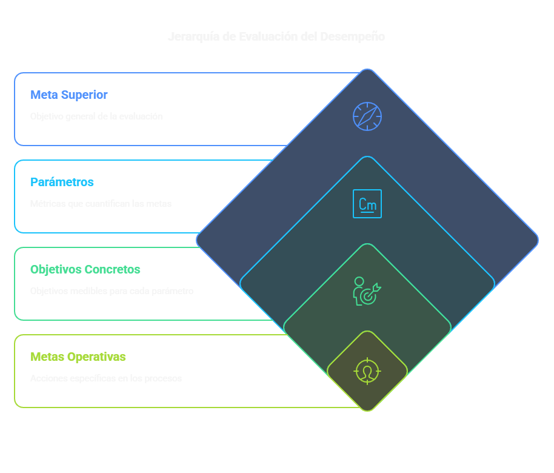
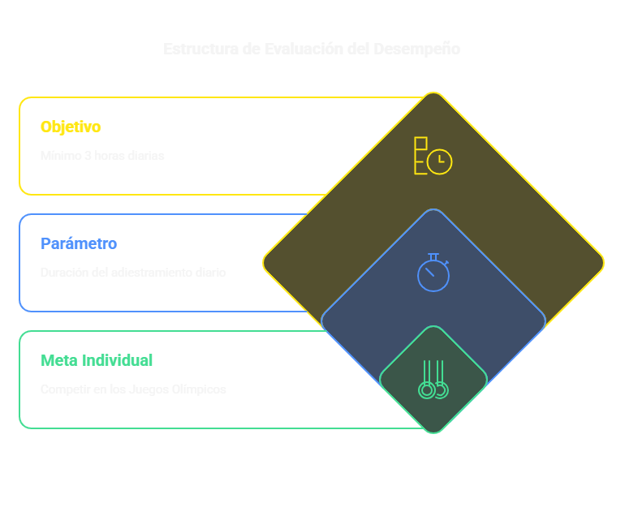
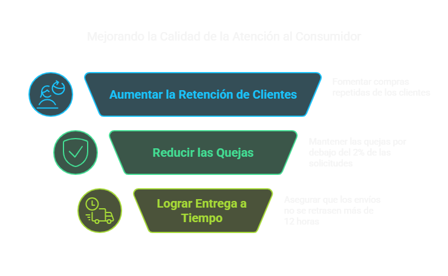
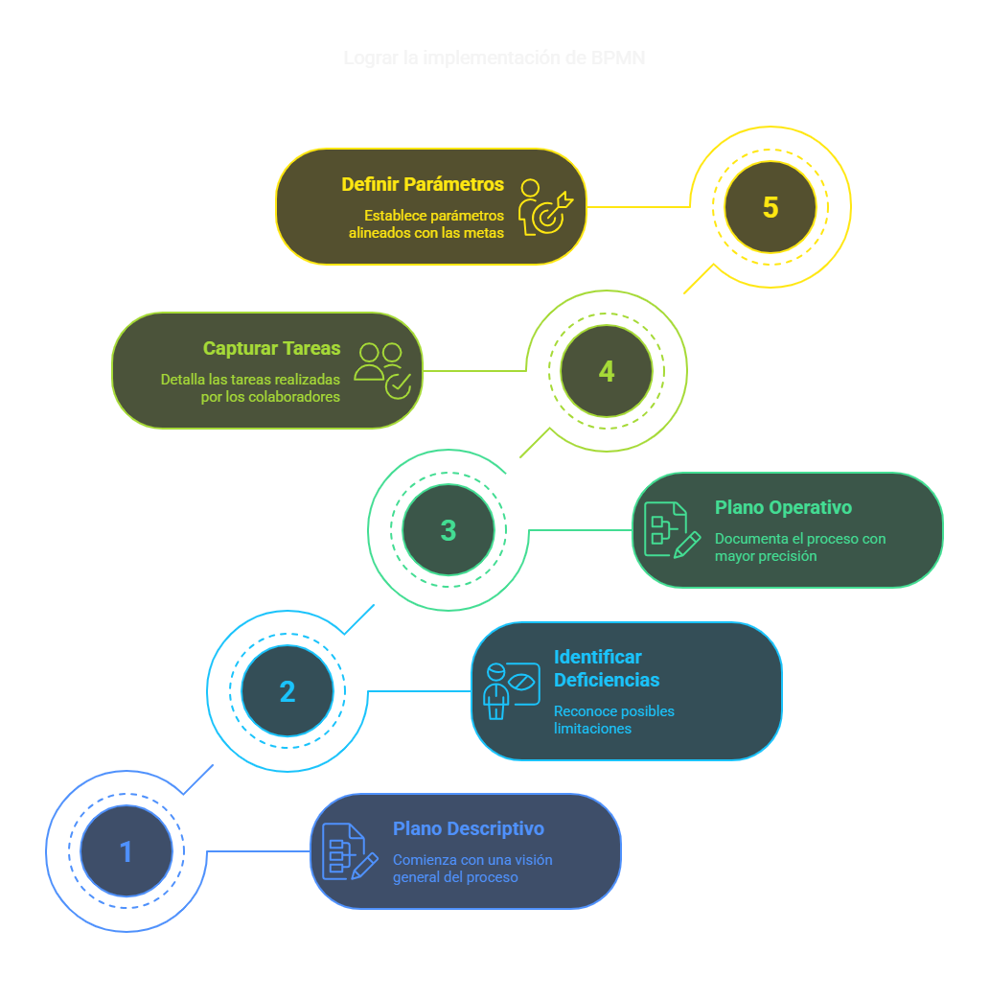

# Evaluación del Desempeño en BPMN

## Finalidad
Comprender la relevancia de evaluar el desempeño al diagramar procesos utilizando el marco BPMN.

## ¿Para qué evaluar el desempeño?

Al diagramar procesos con BPMN, resulta esencial establecer parámetros que nos faculten para valorar si alcanzamos las metas organizacionales. Esto sucede en distintos planos:

1. **Plano estratégico**: Propósito y aspiración empresarial
2. **Plano descriptivo**: Propósitos particulares de los procesos fundamentales
3. **Plano operativo**: Parámetros detallados de las tareas cotidianas

La evaluación del desempeño nos facilita detectar:
- Qué elementos no funcionan adecuadamente en nuestros procesos
- Qué obstáculos nos dificultan alcanzar las metas corporativas
- En qué áreas debemos concentrar nuestras iniciativas de optimización

## Organización de metas y parámetros

### Distribución jerárquica de metas y parámetros

  

### Ilustración básica

- **Meta individual**: Competir en los Juegos Olímpicos
- **Parámetro**: Duración del adiestramiento diario
- **Objetivo**: Como mínimo 3 horas cada día

  

### Ilustración empresarial

- **Meta superior**: Potenciar la calidad de atención al consumidor
  
  - **Parámetro 1**: Cantidad de consumidores que reiteran compras
  
  - **Parámetro 2**: Cantidad de quejas
    - **Objetivo**: No superar el 2% de solicitudes con quejas
    
    - **Meta operativa**: Suministrar artículos puntualmente
      - **Parámetro operativo**: Lapso de envío
      - **Objetivo operativo**: Retraso máximo de 12 horas

  

## Implementación en la diagramación BPMN

Al registrar procesos con BPMN, debemos:

1. Iniciar desde el **plano descriptivo** (nivel 1 en el contexto de procesos BPMN)
2. Reconocer posibles deficiencias o limitaciones
3. Ahondar en el **plano operativo** para documentar con mayor precisión
4. Captar las tareas concretas realizadas por los colaboradores
5. Definir parámetros en cada plano que se correspondan con las metas superiores

  

## Ventajas de evaluar el desempeño

- Posibilita valorar de manera imparcial si alcanzamos las metas
- Simplifica la localización de áreas perfectibles
- Contribuye a priorizar esfuerzos de perfeccionamiento
- Vincula las tareas cotidianas con la estrategia corporativa
- Suministra un vocabulario común para analizar el rendimiento

## Reflexión final

La evaluación del desempeño constituye un elemento indispensable en la diagramación de procesos con BPMN. Nos permite asegurar que los procesos que registramos están alineados con las metas corporativas y que podemos identificar oportunidades de mejoramiento de forma metódica.

Al registrar procesos empleando BPMN, debemos reflexionar constantemente sobre cómo estos procesos aportan a los parámetros de desempeño y, en definitiva, a las metas estratégicas de la organización.
