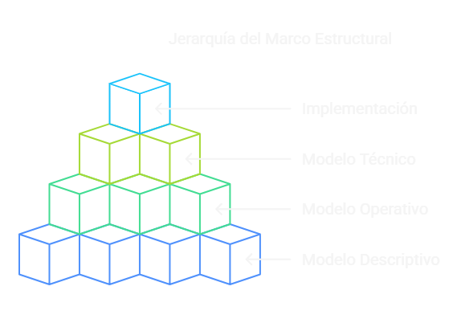
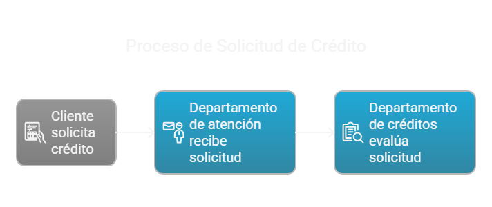
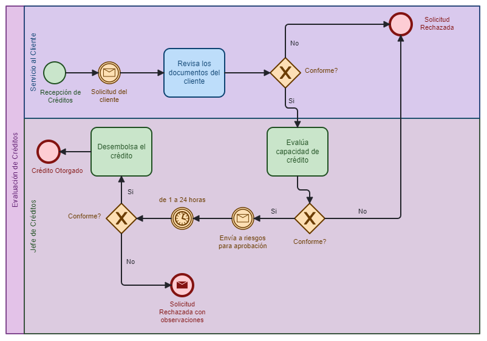
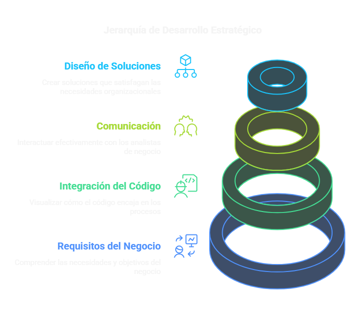

# Introducción a BPMN

## ¿Qué es el Marco Estructural de BPMN?

El marco estructural de BPMN (también llamado "entorno de procesos") es una forma organizada de documentar cómo funciona una empresa a diferentes niveles de detalle. Este marco nos permite entender desde una visión general hasta los detalles más específicos de los procesos de una organización.

## Niveles del Marco Estructural

  

### Nivel 1: Modelo Descriptivo

**¿Qué es?**
- Una vista de alto nivel (macroprocesos)
- Descripción resumida de cómo funciona la organización
- Muestra el alcance y funcionalidad general

**Características:**
- Fácil de entender
- Comprensible para cualquier persona (no solo expertos)
- No requiere cumplimiento estricto del estándar BPMN
- Es genérico pero respeta la simbología básica

**Objetivo:**
Proporcionar una comprensión rápida del funcionamiento de la organización.

**Ejemplo:**
Un diagrama simple que muestra cómo un cliente solicita un crédito, el departamento de atención lo recibe y el departamento de créditos lo evalúa.

  

### Nivel 2: Modelo Operativo

**¿Qué es?**
- Flujo detallado de los procesos
- Desglosa los macroprocesos del nivel 1
- Muestra la secuencia completa de actividades

**Características:**
- Atomización máxima del trabajo en tareas
- Incluye coordinaciones entre diferentes roles
- Detalla los actores del proceso
- Más riguroso en el cumplimiento del estándar BPMN

**Objetivo:**
Entender a detalle cómo funciona cada proceso, sus flujos y quiénes son los actores involucrados.

**Ejemplo:**
Un diagrama detallado que muestra cada paso del proceso de solicitud de crédito, incluyendo la revisión de documentos, evaluación de criterios, aprobación o rechazo, etc.

  

### Nivel 3: Modelo Técnico

**Nivel 3A: Flujo Técnico**
- Base para la automatización del proceso
- Incluye detalles técnicos necesarios para implementar el proceso

**Nivel 3B: Especificaciones para Desarrolladores**
- Instrucciones específicas para desarrolladores de sistemas
- Basado en el modelo técnico para automatizar el proceso

### Nivel 4: Implementación

**¿Qué es?**
- La automatización real del proceso usando herramientas específicas
- Implementación en sistemas de gestión de procesos de negocio

**Características:**
- Contiene detalles principalmente técnicos
- Utiliza herramientas como Bizagi u otras plataformas BPM

**Objetivo:**
Implementar el proceso automatizado en un sistema real.

## Comparación con la Estructura Tradicional

| Estructura Tradicional | Marco BPMN |
|------------------------|------------|
| Nivel 0: Macroprocesos | Nivel 1: Modelo Descriptivo |
| Nivel 1: Procesos | Nivel 2: Modelo Operativo |
| Nivel 2: Subprocesos | Nivel 2: Modelo Operativo |
| Nivel 3: Actividades | Nivel 2: Modelo Operativo |

## Alcance del Curso

Este curso se enfoca en los niveles 1 y 2 del marco estructural de BPMN:
- Nivel 1: Modelo Descriptivo
- Nivel 2: Modelo Operativo

## Importancia para Desarrolladores

Como desarrollador, entender estos niveles te ayudará a:

1. Comprender mejor los requisitos del negocio
2. Visualizar cómo tu código se integra en los procesos más amplios
3. Comunicarte más efectivamente con analistas de negocio
4. Diseñar soluciones que realmente satisfagan las necesidades de la organización

  

## Resumen

BPMN proporciona un marco estructurado para documentar procesos de negocio desde una visión general hasta los detalles técnicos. Los niveles 1 y 2 son fundamentales para entender cómo funciona una organización, mientras que los niveles 3 y 4 se enfocan en la implementación técnica y automatización de esos procesos.