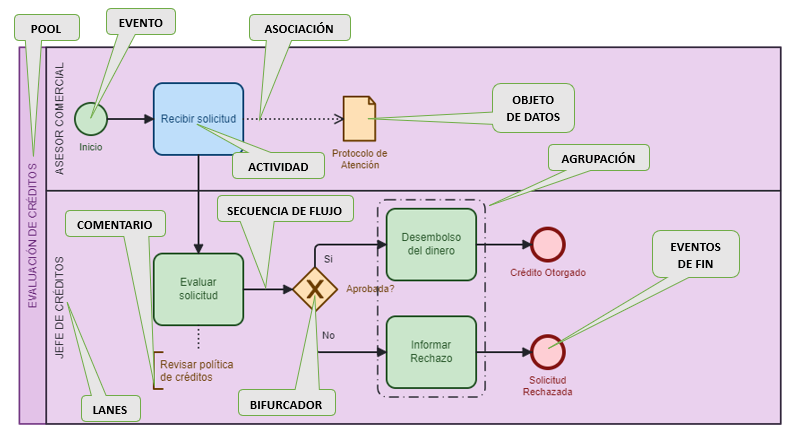
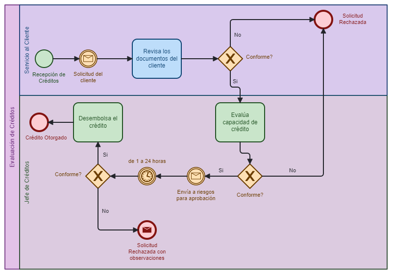

# Elementos Básicos de BPMN

## Objetivo
Aprender la simbología básica de BPMN para iniciar el modelamiento de procesos.

## Grupos Principales de Símbolos

BPMN utiliza cinco grupos principales de elementos:

1. **Objetos de Flujo**
2. **Objetos de Conexión**
3. **Artefactos**
4. **Participantes**
5. **Datos**

  

## Detalle de los Elementos

  

### 1. Objetos de Flujo

#### Actividades
- Representan trabajo que se realiza dentro del proceso
- Se dibujan como **rectángulos con esquinas redondeadas**
- Son la "atomización máxima del trabajo" (no se pueden subdividir más)
- Ejemplos: aprobar solicitud, firmar cheque, entregar pedido

#### Eventos
- Representan algo que ocurre durante el proceso
- Pueden ser:
  - **Eventos de inicio**: donde comienza el proceso
  - **Eventos intermedios**: ocurren durante el proceso
  - **Eventos de fin**: donde termina el proceso
- Se representan con **círculos**

#### Compuertas (Gateways)
- Controlan la divergencia y convergencia del flujo
- Representan decisiones, bifurcaciones, fusiones o uniones
- Se dibujan como **diamantes**
- Permiten tomar diferentes caminos según una condición

### 2. Objetos de Conexión

#### Secuencia de Flujo
- Muestra el orden en que las actividades se ejecutan
- Se representa con una **línea sólida con flecha**
- Indica cómo "fluye" una instancia a lo largo del proceso

#### Flujo de Mensajes
- Representa comunicación entre participantes
- Se dibuja como una **línea discontinua con flecha**

#### Asociación
- Conecta información adicional con elementos gráficos
- Se representa con una **línea punteada**
- Ejemplo: asociar un documento importante a una actividad

### 3. Artefactos

#### Comentarios (Anotaciones de Texto)
- Proporcionan información adicional sobre el proceso
- Permiten ampliar lo que dice una actividad

#### Agrupaciones
- Agrupan elementos por alguna razón importante
- No afectan el flujo del proceso

### 4. Participantes

#### Pool
- Representa un participante en el proceso
- Contiene un proceso completo
- Actúa como un contenedor de un flujo de proceso

#### Lane (Carril)
- Subdivisión dentro de un pool
- Representa roles diferentes dentro del mismo proceso
- **Importante**: los lanes representan roles, no personas

### 5. Datos

#### Objeto de Datos
- Representa información que fluye a través del proceso
- Documentos, formularios, etc.

#### Almacén de Datos
- Representa un lugar donde se guardan o recuperan datos

## Conceptos Importantes

### Flujo y Modelo
- **Flujo**: secuencia de actividades que ocurren en un proceso
- **Modelo**: documentación del flujo del proceso

### Token
- Es el "vehículo" conceptual que lleva una instancia a lo largo del flujo
- Permite visualizar cómo se mueve una instancia por el proceso
- Ejemplo: si el flujo llega a una compuerta, el token seguirá uno de los caminos según la condición evaluada

### Instancia
- Cada caso individual que pasa por el flujo
- Ejemplo: en un proceso de evaluación de créditos, cada solicitud es una instancia
- Cada instancia tiene un identificador único (ID)
- Permite hacer seguimiento a casos específicos

## Ejemplo Práctico

  

Imagina un proceso de evaluación de solicitudes de crédito:

1. Cada solicitud de crédito es una **instancia**
2. El **token** es el concepto que representa cómo esa solicitud se mueve por el proceso
3. Cuando un cliente llama preguntando por su solicitud #3028, ese número identifica la instancia específica
4. La solicitud pasa por diferentes **actividades** (revisar documentos, evaluar capacidad de pago)
5. Puede encontrar **eventos** (llegada de documentación adicional)
6. Pasará por **compuertas** (¿Cumple requisitos? Sí/No)
7. Todo esto ocurre dentro de **pools** y **lanes** que representan la organización y sus roles

## Resumen

La simbología básica de BPMN nos permite representar visualmente cómo funciona un proceso de negocio, mostrando las actividades que se realizan, quién las realiza, en qué orden ocurren y qué decisiones se toman durante el proceso.