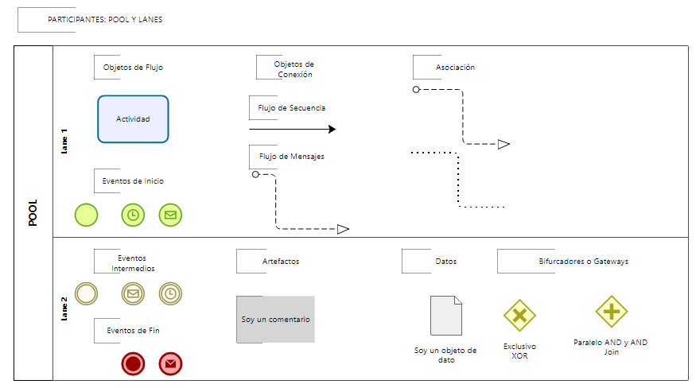
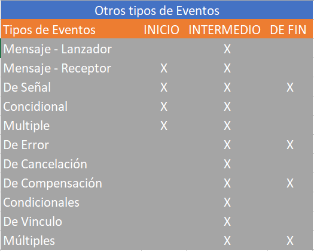
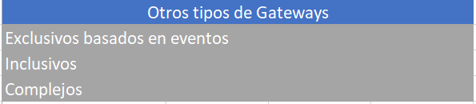

# ¿Qué más nos ofrece BPMN?

## Resumen del Curso

Llegamos a la parte final del curso, Sesión cuatro, parte 11. Haremos un resumen de lo que hemos aprendido y qué más nos ofrece BPMN.

### ¿Qué aprendimos?

#### Entorno de Procesos BPMN
- El modelo operativo definitivo al más alto nivel
- Documentación de flujos en el modelo operativo
  

  

#### Objetos de Flujo
- **Actividades**: Representación de tareas y subprocesos
- **Eventos**:
  - **De inicio**: Simple, Temporizador (gatilla el proceso en un día/hora determinada), Mensaje (gatilla el proceso cuando recibe un mensaje)
  - **Intermedios**: Simple, Mensaje, Temporizador
  - **De finalización**: Simple, Mensaje (culmina el proceso enviando un mensaje)

#### Objetos de Conexión
- **Flujo de secuencia**: Para conectar actividades, eventos y gateways
- **Flujo de mensajes**: Para comunicar dos procesos
- **Asociación**: Para agregar información adicional como comentarios o documentos de consulta

#### Artefactos
- Comentarios
- Objetos de datos (ej. procedimientos complementarios para la ejecución de actividades)

#### Bifurcaciones (Gateways)
- **Exclusivos**: Bifurca el flujo dependiendo del resultado de la decisión por un solo camino
- **Paralelos**: Bifurca el flujo para ejecutar dos o más actividades en forma paralela

#### Participantes y Roles
- **Pools**: Para identificar procesos
- **Lanes**: Para identificar roles dentro de un proceso

## Herramientas

Para demostrar los flujos de procesos usamos el modelador Bizagi, que tiene embebido el estándar BPMN. Puede descargarlo gratuitamente.
*   **Bizagi Modeler:** Una herramienta gratuita y muy popular para modelar procesos BPMN. Es fácil de usar y tiene una interfaz intuitiva.
*   **Bizagi Modeler:** Una herramienta gratuita y muy popular para modelar procesos BPMN. Es fácil de usar y tiene una interfaz intuitiva. Puedes descargarla desde [aquí](https://www.bizagi.com/en/platform/modeler).
*   **Camunda Modeler:** Otra herramienta de modelado BPMN de código abierto, parte de la plataforma Camunda. Es potente y flexible.
*   **Signavio Process Manager:** Una solución basada en la nube más orientada a empresas, con funcionalidades colaborativas avanzadas.
*   **Lucidchart:** Una herramienta de diagramación en línea que soporta BPMN entre muchos otros tipos de diagramas.
*   **BPMN.io Editor (Extensión VS Code):** Una extensión para Visual Studio Code que te permite editar archivos BPMN 2.0 directamente en tu editor, impulsada por las herramientas de [bpmn.io](https://bpmn.io/). Puedes encontrarla en el [Marketplace de VS Code](https://marketplace.visualstudio.com/items?itemName=bpmn-io.vs-code-bpmn-io).

## BPMN Avanzado

BPMN ofrece además diversos tipos de eventos:
- Mensaje (lanzador/receptor)
- Señal
- Condicional
- Múltiple
- Error
- Cancelación
- Compensación
- Vínculo

  

Estos se aplican a los eventos de inicio, intermedios y de fin, potenciando la capacidad para documentar cualquier tipo de proceso.

También existen diferentes tipos de gateways adicionales:
- Basados en eventos
- Inclusivos
- Complejos

  

## Conclusión

Este curso ha cubierto los fundamentos de BPMN.
