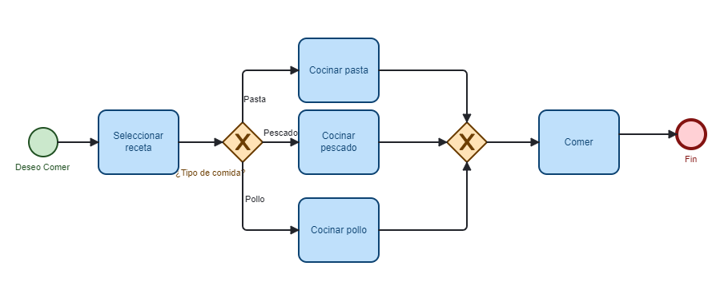
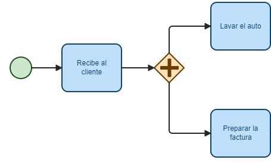
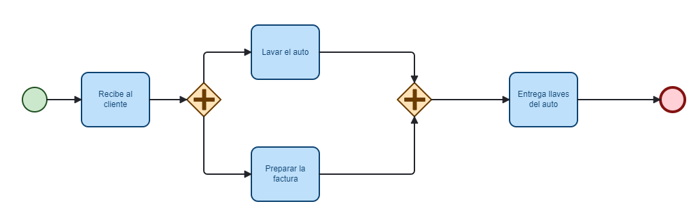
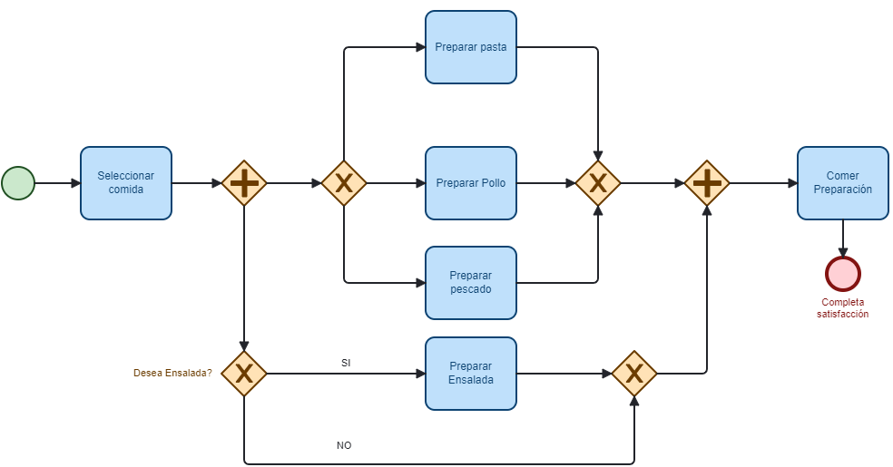

# Bifurcadores Principales (Gateways) en BPMN

## Introducción

En esta sección aprenderemos sobre los bifurcadores (gateways) y sus tipos en BPMN (Business Process Model and Notation). Los bifurcadores son elementos esenciales que permiten controlar la divergencia y convergencia de los flujos dentro de un proceso.

## ¿Qué son los bifurcadores?

Los bifurcadores direccionan el camino del flujo de acuerdo a una determinada condición. Se representan gráficamente con un **rombo** en la notación BPMN.

## Tipos de bifurcadores

### 1. Bifurcador Exclusivo (Exclusive Gateway o XOR)

El bifurcador exclusivo dirige el flujo por uno solo de los caminos posibles, dependiendo de una condición que se evalúa.

#### Características:

- Se representa con un rombo simple o con una "X" en su interior
- Solo puede tomar uno de los caminos alternativos
- La decisión depende del resultado de una condición

#### Ejemplo:

En un proceso de preparación de comida:

1. Inicio del proceso: "Deseo comer"
2. Seleccionar receta
3. Bifurcador exclusivo: "¿Tipo de comida?"
4. Opciones:
   - Si selecciono pasta → Se bifurca hacia "Cocinar pasta"
   - Si selecciono pescado → Se bifurca hacia "Cocinar pescado"
   - Si selecciono pollo → Se bifurca hacia "Cocinar pollo"
5. Comer preparación
6. Fin del proceso

Solo se ejecutará una de las tres actividades, dependiendo de la decisión tomada en el bifurcador.

  

### 2. Bifurcador Paralelo (Parallel Gateway o AND)

Este bifurcador permite que varias actividades se ejecuten en paralelo, sin dependencia entre ellas.

#### Características:

- Se representa con un rombo con un signo "+" en su interior
- Permite la ejecución simultánea de múltiples caminos
- El token se clona para ejecutar cada camino en paralelo

#### Ejemplo:

En un taller mecánico:

1. Recepción del cliente: "Su auto ya está listo"
2. Bifurcador paralelo:
   - Por un lado: "Preparar factura para pago"
   - Simultáneamente: "Terminar de lavar el auto"
3. Ambas actividades no dependen una de otra y pueden ejecutarse en paralelo

  

### 3. Compuerta de unión (Join)

La compuerta de unión permite reunir los flujos que fueron bifurcados anteriormente.

#### Características del Join Paralelo:

- Se representa igual que el bifurcador paralelo (rombo con signo "+")
- Espera a que todos los flujos paralelos culminen antes de continuar
- Solo cuando todas las actividades previas han finalizado, el flujo continúa

#### Ejemplo (continuación del ejemplo anterior):

1. Después de "Preparar factura para pago" y "Terminar de lavar el auto"
2. Compuerta de unión: Espera que ambas actividades culminen
3. Actividad siguiente: "Entregar llaves al cliente"
4. El cliente puede retirar su auto solo cuando ambas actividades han finalizado 

  

## Combinación de bifurcadores

Los bifurcadores pueden combinarse para modelar flujos más complejos.

### Ejemplo combinado:

Proceso de preparación de comida con opción de ensalada:

1. Inicio del proceso
2. Bifurcador paralelo:
   - Por un lado: "¿Desea comer ensalada?" (Bifurcador exclusivo)
     - Si la respuesta es "Sí" → "Preparar ensalada"
     - Si la respuesta es "No" → No se prepara
   - Simultáneamente: "¿Qué plato principal desea?" (Bifurcador exclusivo)
     - Opciones: pasta, pescado o pollo
3. Unión paralela: Cuando se termina de preparar tanto el plato principal como la ensalada (si se eligió)
4. Actividad final: "Comer"

  

## Resumen

- **Bifurcador Exclusivo (XOR)**: Bifurca el flujo dependiendo del resultado de una condición y permite tomar solo uno de los caminos posibles.
- **Bifurcador Paralelo (AND)**: Cuando el token llega a este bifurcador, se toman todos los caminos paralelos simultáneamente.
- **Compuerta de unión**:
  - Para flujos exclusivos: Permite que cualquiera de los caminos anteriores continúe el flujo
  - Para flujos paralelos: Requiere que todas las actividades paralelas terminen antes de continuar

Los bifurcadores son elementos fundamentales en BPMN que permiten modelar decisiones y actividades concurrentes, haciendo que los diagramas representen fielmente la complejidad de los procesos de negocio reales.
