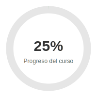
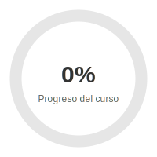

# Curso de BPMN

<div align="center">
  
</div>

## 📋 Seguimiento de Progreso

Este README incluye un sistema de seguimiento para marcar tu avance en el curso. Cada módulo completado representa un 25% del progreso total.

### Cómo utilizar este sistema:

1. **Marca las lecciones completadas** cambiando `[ ]` por `[x]` en las casillas
2. **Cuando completes un módulo entero**, actualiza el badge de progreso según las instrucciones al final

## Módulo 1: Fundamentos de BPMN (25% del total)
- [x] Lección 1.1: Introducción a BPMN
- [x] Lección 1.2: Elementos básicos de modelado
- [x] Lección 1.3: Flujos y conexiones

## Módulo 2: Modelado de Procesos (25% del total)
- [ ] Lección 2.1: Actividades y tareas
- [ ] Lección 2.2: Eventos y compuertas
- [ ] Lección 2.3: Pools y lanes

## Módulo 3: BPMN Avanzado (25% del total)
- [ ] Lección 3.1: Subprocesos y transacciones
- [ ] Lección 3.2: Manejo de excepciones
- [ ] Lección 3.3: Eventos complejos

## Módulo 4: Implementación Práctica (25% del total)
- [ ] Lección 4.1: Herramientas BPMN
- [ ] Lección 4.2: Caso práctico completo

---

## 🔄 Instrucciones para Actualizar el Progreso

### Pasos para actualizar el badge de progreso:

1. Cuando completes todas las lecciones de un módulo, busca esta línea en la parte superior del archivo:
   ```markdown
   
   ```

2. Cámbiala según tu progreso:
   - Para 25% (1 módulo): ``
   - Para 50% (2 módulos): ``
   - Para 75% (3 módulos): ``
   - Para 100% (4 módulos): ``

3. Haz commit y push de los cambios para actualizar el README.

---

_¡Buena suerte con tu curso de BPMN!_
