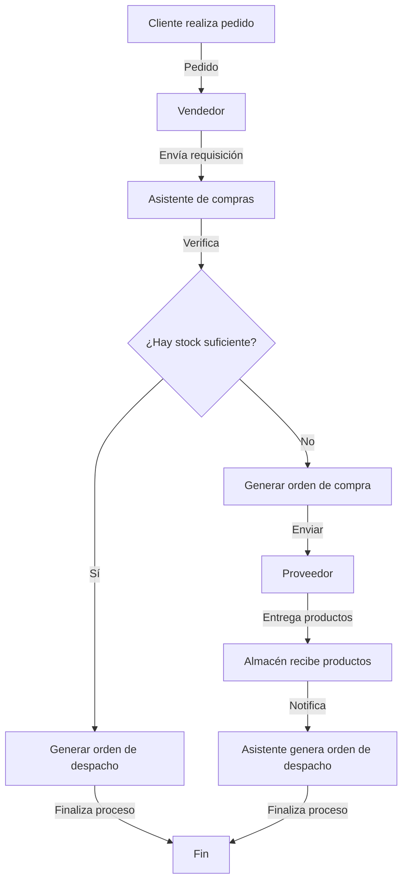

# Guía Completa: Análisis de Procesos y Modelado BPMN

## PARTE 1: DESCRIPCIÓN DEL PROCESO ORIGINAL

### Contexto
La empresa A se dedica a la comercialización de repuestos para automóviles (autopartes). Uno de sus procesos claves es el proceso de **COMPRAS**. Se entrevistó al responsable del proceso para que nos comente en detalle cómo funciona, a continuación se detalla la conversación sostenida con el Sr. Pedro Lara y el consultor Jorge Perez.

### Entrevista

#### Inicio del proceso

**Jorge Perez:** Buenas tardes Sr. Lara ¿podría comentarnos cómo se inicia el proceso de compras?

**Pedro Lara:** Normalmente contamos con un stock de seguridad de las autopartes que tienen mayor rotación, pero este está destinado a atender a los clientes de tienda. Cuando un cliente importante hace un pedido al uno de los vendedores, este envía requisición al asistente de compras detallando el o los productos y las cantidades. Con esto se inicia el proceso ya que no mantenemos stock para pedidos grandes.

#### Verificación de stock

**Jorge Perez:** ¿Qué pasa después?

**Pedro Lara:** Lo primero que hacemos es revisar si existe stock del producto(s), de existir lo que hacemos es generar una orden de despacho al almacén.

#### Manejo de falta de stock

**Jorge Perez:** ¿Qué pasa si no hay stock o si este no alcanza para atender el pedido?

**Pedro Lara:** Normalmente tenemos stock de seguridad, sin embargo si este no alcanza para atender el pedido se genera una orden de compra y se le envía al proveedor para reponer el stock y para atender el pedido.

#### Tiempos de atención y finalización

**Jorge Perez:** ¿Cuánto tiempo toma el proveedor en atender la orden de compra y como se entera que esta fue atendida para atender el pedido del cliente?

**Pedro Lara:** Normalmente los proveedores se toman 1 o 2 días para atender la O/C, cuando esta llega, almacén nos envía un correo, con esto podemos generar la orden de despacho al almacén, así culmina nuestro proceso de atención.

### Resumen del proceso
1. Cliente importante realiza pedido a vendedor
2. Vendedor envía requisición al asistente de compras
3. Asistente verifica existencia de stock
4. Si hay stock: se genera orden de despacho al almacén
5. Si no hay stock: se genera orden de compra al proveedor
6. Proveedor atiende en 1-2 días
7. Almacén notifica llegada de productos
8. Se genera orden de despacho y finaliza el proceso

---

## PARTE 2: METODOLOGÍA PARA ANÁLISIS Y ESTRUCTURACIÓN DE PROCESOS

### 1. Análisis Inicial del Texto

#### a) Lectura Comprensiva
- Lee el texto completo al menos dos veces para comprender el contexto general
- Identifica el propósito del proceso (en este caso: atención de requisiciones de materiales)
- Reconoce la empresa y su actividad (comercialización de autopartes)

#### b) Identificación de Elementos Clave
Busca y subraya en el texto:
- **Actores/Participantes**: Quiénes intervienen en el proceso (vendedor, asistente de compras, almacén, proveedor)
- **Actividades**: Qué acciones se realizan 
- **Decisiones**: Dónde hay bifurcaciones en el proceso
- **Eventos**: Cómo inicia y termina el proceso
- **Documentos**: Qué documentación se genera (requisiciones, órdenes de compra)

### 2. Estructuración de la Información

#### a) Organización por Secciones
Organiza la información en secciones lógicas:
- Contexto general
- Inicio del proceso
- Actividades principales
- Puntos de decisión
- Finalización

#### b) Creación de una Narrativa Clara
- Utiliza encabezados y subencabezados para jerarquizar la información
- Aplica formato (negritas, cursivas) para destacar elementos importantes
- Convierte diálogos en descripciones de proceso más formales cuando sea necesario

### 3. Identificación y Enumeración del Flujo del Proceso

#### a) Secuencia Cronológica
Crea una lista numerada con todos los pasos del proceso en orden cronológico:

1. Cliente importante realiza pedido a vendedor
2. Vendedor envía requisición al asistente de compras
3. Asistente verifica existencia de stock
4. [Punto de decisión] ¿Existe stock suficiente?
   - **Sí**: Se genera orden de despacho al almacén
   - **No**: Se genera orden de compra al proveedor
5. Proveedor recibe orden de compra
6. Proveedor atiende pedido (1-2 días)
7. Almacén recibe productos
8. Almacén notifica llegada mediante correo
9. Se genera orden de despacho
10. Finaliza el proceso de atención

#### b) Matriz RACI (opcional pero muy útil)
Crea una tabla que muestre quién es Responsable, Aprobador, Consultado e Informado en cada paso:

| Paso | Vendedor | Asistente Compras | Almacén | Proveedor |
|------|----------|-------------------|---------|-----------|
| 1. Recepción pedido | R | I | - | - |
| 2. Envío requisición | R | I | - | - |
| 3. Verificación stock | - | R | C | - |
| 4a. Orden despacho (si hay stock) | - | R | I | - |
| 4b. Orden compra (si no hay stock) | - | R | I | I |
| 5. Recepción orden compra | - | - | - | R |
| 6. Atención de pedido | - | I | I | R |
| 7. Recepción productos | - | I | R | - |
| 8. Notificación llegada | - | I | R | - |
| 9. Generación orden despacho | - | R | I | - |

### 4. Identificación de Elementos BPMN Específicos

#### a) Carriles (Lanes) y Piscinas (Pools)
- **Piscina principal**: Empresa A (proceso interno)
- **Carril 1**: Ventas (vendedor)
- **Carril 2**: Compras (asistente)
- **Carril 3**: Almacén
- **Piscina externa**: Proveedor

#### b) Tipos de Eventos
- **Evento de inicio**: Recepción de pedido de cliente importante
- **Eventos intermedios**: Notificación de llegada de productos
- **Evento de fin**: Generación de orden de despacho completada

#### c) Compuertas (Gateways)
- Verificación de stock (compuerta exclusiva)

#### d) Actividades y Tareas
- Envío de requisición
- Verificación de stock
- Generación de orden de compra
- Generación de orden de despacho

### 5. Preparación para el Diagramado

#### a) Diagrama de Alto Nivel
Antes de hacer el BPMN detallado, dibuja un diagrama de flujo simple que muestre:
- Inicio → Proceso principal → Fin
- Principales puntos de decisión
- Bucles o iteraciones

#### b) Notas de Excepciones y Reglas de Negocio
Documenta detalles adicionales como:
- Tiempos de espera (1-2 días para atención de O/C)
- Políticas (ej: stock de seguridad solo para clientes de tienda)
- Excepciones (¿qué ocurre si el proveedor no puede atender?)

### 6. Consejos para Trabajo In Situ

#### a) Lleva Plantillas
- Prepara plantillas en papel o Excel para la extracción de información
- Usa plantillas de entrevista estructuradas

#### b) Técnicas de Entrevista
- Usa preguntas abiertas ("¿Qué ocurre después?")
- Complementa con preguntas cerradas para confirmar entendimiento
- Pregunta específicamente por excepciones ("¿Qué pasa si...?")

#### c) Herramientas Análogas
- Notas adhesivas (post-its) para identificar pasos y reorganizarlos
- Papel grande para hacer bocetos del flujo
- Códigos de colores para diferentes tipos de actividades

#### d) Metodología Estructurada
1. Entrevista inicial para visión general
2. Segunda ronda para detalles específicos
3. Validación con los participantes
4. Documentación formal
5. Boceto del diagrama
6. Revisión del boceto con stakeholders
7. Finalización del diagrama BPMN

---

## PARTE 3: EJEMPLO DE TRANSFORMACIÓN DE TEXTO A ANÁLISIS ESTRUCTURADO

### Texto original:
```
Pedro Lara:
Normalmente contamos con un stock de seguridad de las autopartes que tienen mayor rotación, pero 
este está destinado a atender a los clientes de tienda. Cuando un cliente importante hace un pedido al 
uno de los vendedores, este envía requisición al asistente de compras detallando el o los productos y 
las cantidades. Con esto se inicia el proceso ya que no mantenemos stock para pedidos grandes.
```

### Análisis estructurado:
- **Contexto:** Empresa mantiene stock de seguridad solo para clientes de tienda
- **Evento inicial:** Pedido de cliente importante
- **Actor 1:** Vendedor
- **Acción 1:** Envío de requisición
- **Actor 2:** Asistente de compras
- **Documento 1:** Requisición (contenido: productos y cantidades)
- **Regla de negocio:** No se mantiene stock para pedidos grandes

---

## PARTE 4: DIAGRAMA BPMN CONCEPTUAL DEL PROCESO



## PARTE 5: DIAGRAMA BPMN COMPLETO (VERSIÓN PARA IMPLEMENTAR)

Para implementar el diagrama BPMN completo, se recomendaría utilizar herramientas especializadas como:
- Bizagi Modeler
- Camunda Modeler
- Draw.io (con biblioteca BPMN)
- Lucidchart
- Microsoft Visio
- **BPMN.io Editor** (extensión de Visual Studio Code)

El diagrama completo debería incluir:
1. Pools y lanes para todos los participantes
2. Eventos de inicio, intermedios y fin
3. Compuertas para decisiones
4. Flujos de secuencia y mensajes
5. Actividades con sus tipos (manuales, de servicio, etc.)
6. Artefactos (documentos generados)
7. Anotaciones para reglas de negocio

---

## PARTE 6: TÉCNICAS PARA LLEGAR A UN MAYOR NIVEL DE DETALLE

### 1. Descomponer la Narración en Secuencias Atómicas

#### Técnica:
- Identifica cada acción individual que ocurre en el proceso
- Divide las acciones compuestas en acciones simples
- Organiza las acciones en orden cronológico estricto

#### Ejemplo práctico:
De la frase original: 
> "...se genera una orden de compra y se le envía al proveedor para reponer el stock..."

Se convierte en dos acciones discretas:
1. "El asistente de compras genera una orden de compra"
2. "El asistente envía la orden de compra al proveedor"

### 2. Aplicar Estructura Jerárquica a las Decisiones

#### Técnica:
- Identifica todos los puntos de decisión (bifurcaciones)
- Crea rutas alternativas completas para cada opción
- Numera las rutas de manera sistemática (5A, 5B, etc.)

#### Ejemplo práctico:
El punto de decisión "¿Hay stock suficiente?" genera dos rutas completas:
- Ruta 5A: Con stock suficiente
- Ruta 5B: Sin stock suficiente

### 3. Especificar Claramente los Actores

#### Técnica:
- Asegúrate de que cada acción tiene un actor específico
- Incluye el actor al inicio de cada descripción de acción
- Usa términos consistentes para los mismos actores

#### Ejemplo práctico:
- "El asistente de compras revisa el stock" (en lugar de "se revisa el stock")
- "El almacén notifica la llegada de los productos" (en lugar de "se notifica")

### 4. Utilizar Formato Visual para Mejorar la Legibilidad

#### Técnica:
- Usa negrita para destacar acciones principales
- Emplea indentación para mostrar jerarquía
- Implementa numeración clara y consistente

#### Ejemplo práctico:
```
4. **Verificación de stock suficiente**:
   - Si hay stock suficiente → Continúa en paso 5A
   - Si no hay stock suficiente → Continúa en paso 5B
```

### 5. Agregar Detalles de Tiempo y Condiciones

#### Técnica:
- Incorpora información temporal cuando está disponible
- Incluye condiciones específicas para decisiones
- Agrega detalles operativos relevantes

#### Ejemplo práctico:
- "El proveedor atiende la orden de compra (toma 1-2 días)"
- "Si hay stock suficiente → Continúa en paso 5A"

### 6. Indicar Claramente el Inicio y Fin del Proceso

#### Técnica:
- Marca explícitamente dónde comienza el proceso
- Señala todos los posibles puntos de finalización
- Usa un formato consistente para estos eventos especiales

#### Ejemplo práctico:
- "**Inicio**: Un cliente importante hace un pedido..."
- "Fin del proceso" (en ambas rutas alternativas)

### 7. Técnicas de Entrevista para Obtener estos Detalles

#### Preguntas de profundización:
- "¿Quién exactamente realiza esta acción?"
- "¿Qué ocurre inmediatamente después?"
- "¿Cuánto tiempo toma normalmente este paso?"
- "¿Hay algún sistema o herramienta específica que se utilice?"
- "¿Qué documento/información se genera en este paso?"

#### Preguntas de verificación:
- "Entonces, después de que [acción X], ¿lo siguiente que ocurre es [acción Y]?"
- "¿He entendido correctamente que [actor Z] es quien realiza esta tarea?"
- "¿Existen otras condiciones o situaciones especiales que no hayamos considerado?"

---

## REFERENCIAS Y RECURSOS ADICIONALES

- **BPMN 2.0 Specification**: [OMG.org](https://www.omg.org/spec/BPMN/2.0/)
- **Estándares de modelado**: [ISO/IEC 19510:2013](https://www.iso.org/standard/62652.html)
- **Libros recomendados**:
  - "BPMN Method and Style" por Bruce Silver
  - "Real-Life BPMN" por Jakob Freund y Bernd Rücker
- **Herramientas**:
  - **BPMN.io Editor para VS Code**: Extensión que permite crear y editar diagramas BPMN directamente en Visual Studio Code. Se integra perfectamente con el flujo de trabajo de desarrollo y soporta la sintaxis BPMN 2.0 completa.
    - [Enlace a la extensión BPMN.io Editor](https://marketplace.visualstudio.com/items?itemName=bpmn-io.vs-code-bpmn-io)
    - Características: Vista previa en tiempo real, validación de sintaxis, exportación a diferentes formatos.
